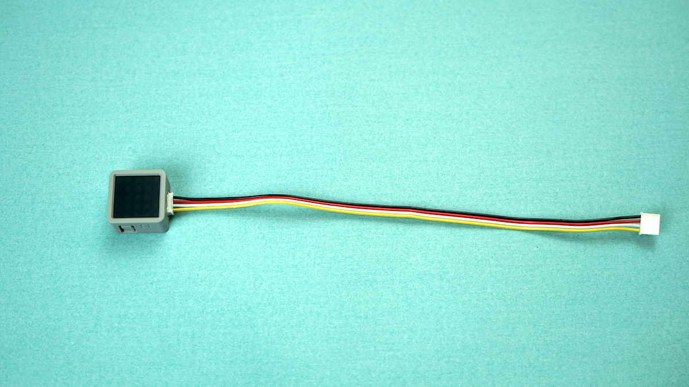
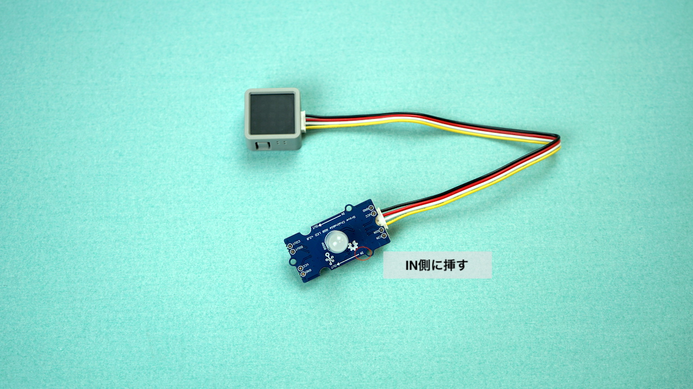
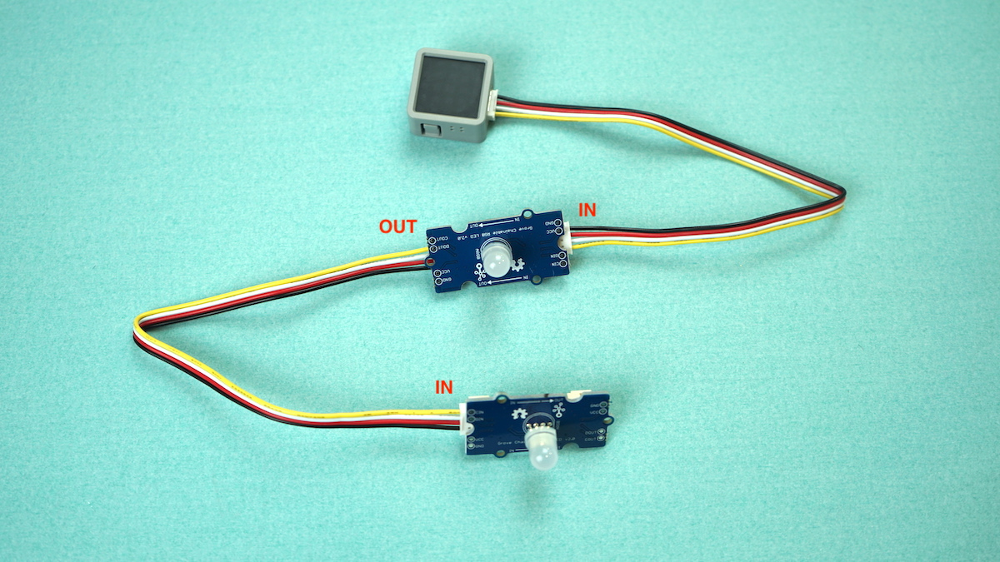
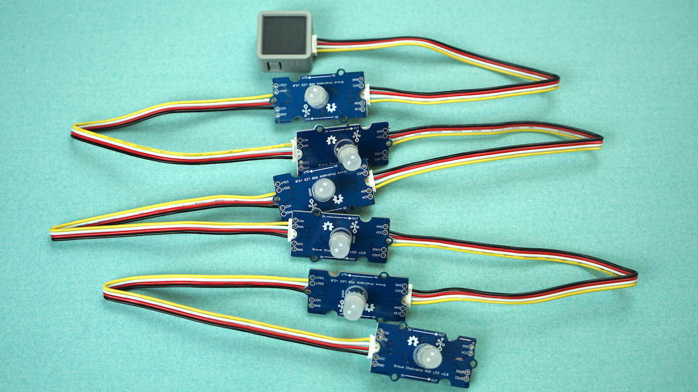
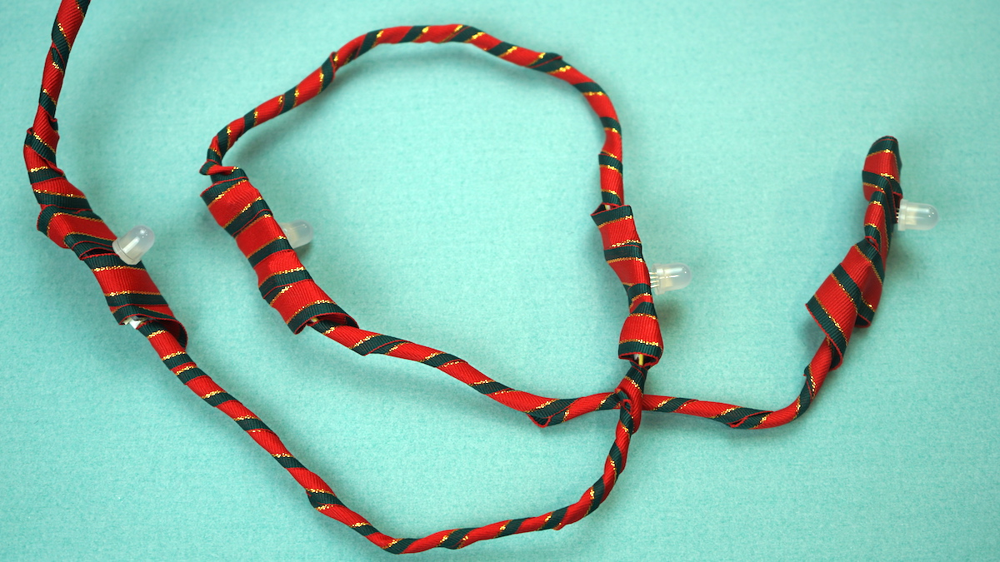
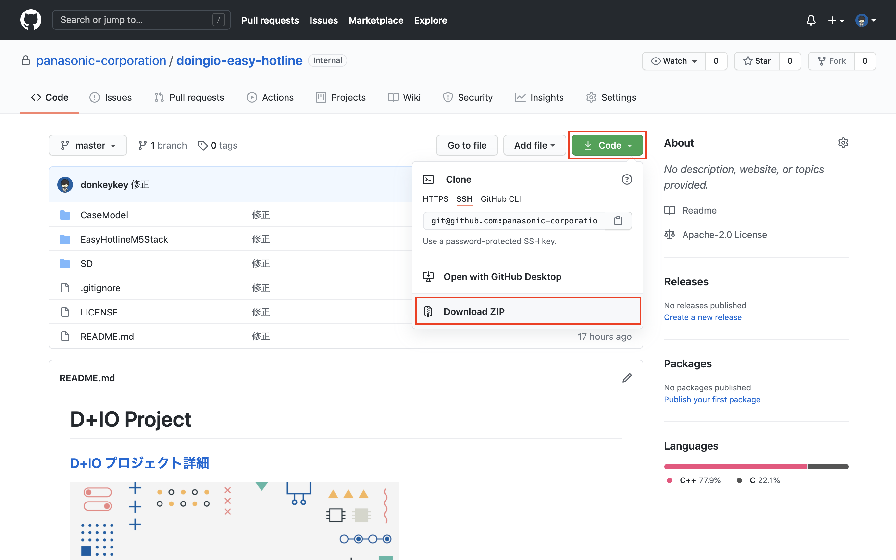
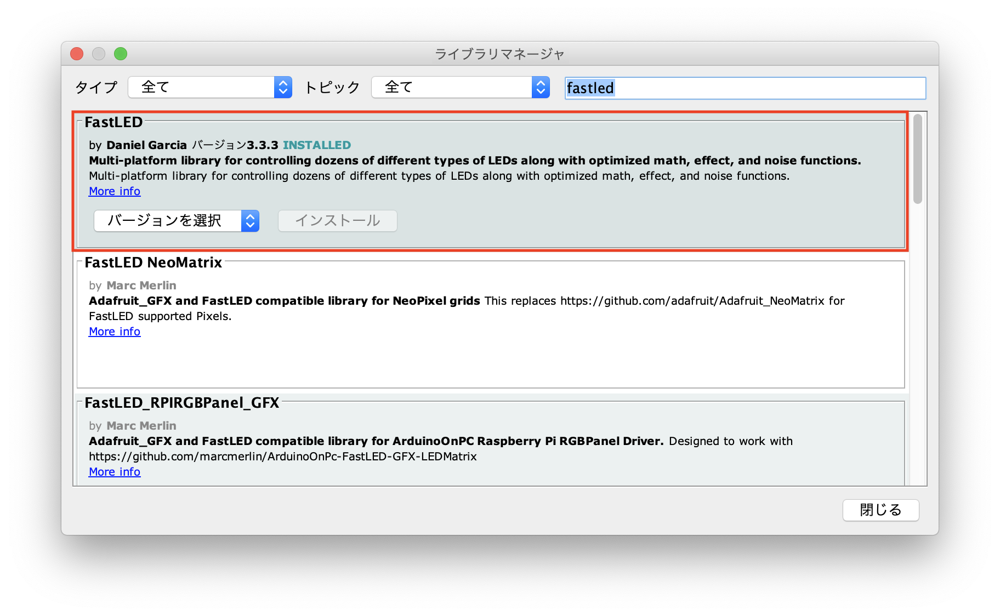
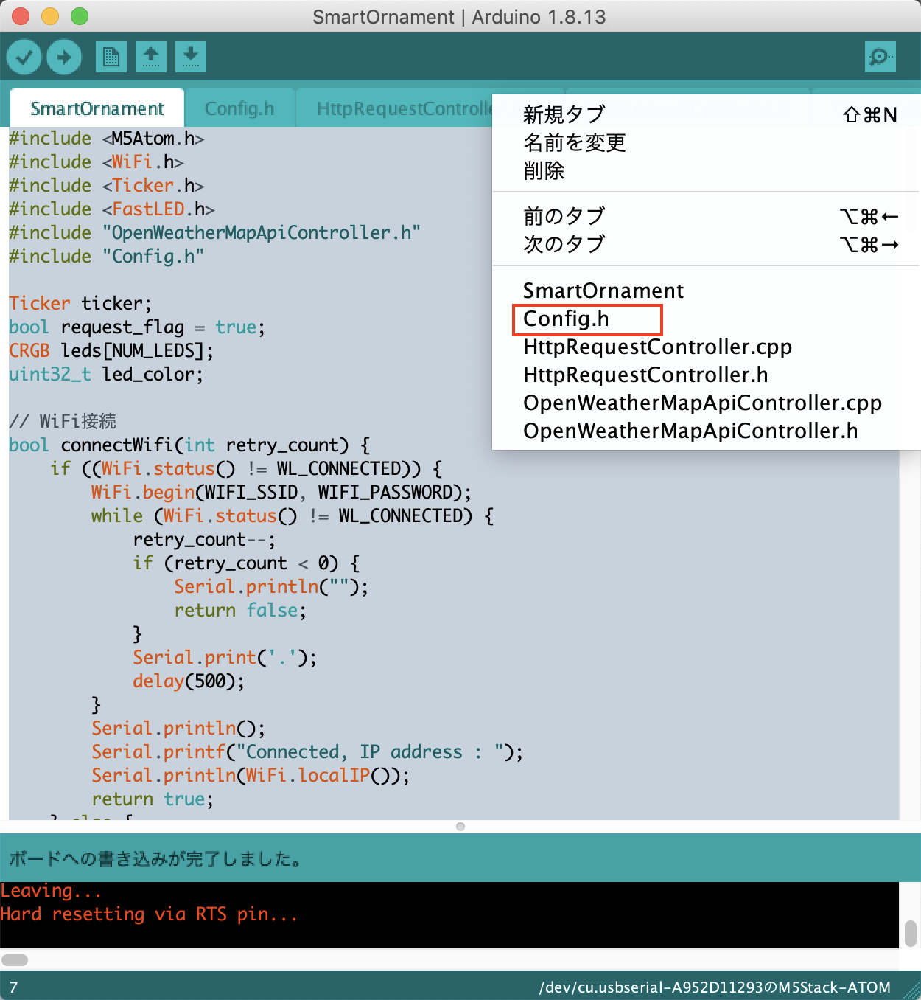
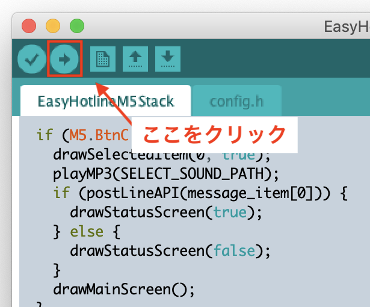

#  D+IO Project
**パナソニック株式会社/FUTURE LIFE FACTORY**
 D+IOプロジェクトは、「大切な誰かへ届けたいみんなのモノづくり」を応援する活動です。
### [D+IO プロジェクト詳細](https://panasonic.co.jp/design/flf/works/doing_io/)

  

## 【D+IO PRODUCT 第4弾】 スマートオーナメント SmartOrnament
第4弾は、季節の飾りをスマート化できる「スマートオーナメント SmartOrnament」です。
LEDの色で明日の天気が分かります。

**天気予報は気象庁のWeb公開情報を取得しています**

**ソースコードは別リポジトリです**
 [https://github.com/panasonic-corporation/doingio-smart-ornament](https://github.com/panasonic-corporation/doingio-smart-ornament)

 

クリスマスやハロウィンなど、季節に合わせて飾り付けるオブジェクト。
そのオーナメントをインターネットにつなげて少しスマートにしたらどうなるでしょう。

例えば天気予報の情報をWeb上から取得すれば、明日の天気に応じてオーナメントのLEDの色を変えることができます。

空間を彩る飾りに機能を付加することで、少し生活が便利になるかもしれません。

APIを変えたり光り方をカスタマイズし、あなたの欲しい情報を可視化してみましょう！

# [SmartOrnament] 作り方ドキュメント
ATOM Matrix / ATOM Liteで作るSmartOrnamentの作り方を紹介します。

**ソースコードは別リポジトリです [https://github.com/panasonic-corporation/dio-smart-ornament](https://github.com/panasonic-corporation/dio-smart-ornament)**

  
# 作り方

## 1 準備

### 必要なパーツを用意

<a href="https://www.switch-science.com/catalog/8252/"> スイッチサイエンスでキットを購入する</a>

## 2 配線 / 組み立て

1. ATOM Lite / ATOM Matrix に Groveケーブルを接続します。

    

1. LED に Groveケーブルを接続します。 基板に記載されている IN という表記がある方のコネクタにケーブルを挿してください。

    

1. ATOM LIte / ATOM Matrix から LED終端に向かって IN → OUT となるようにLEDとGroveケーブルを接続していきます。

    

1. 必要な分だけLEDを接続します。

    

1. ケーブルや基板を隠すためリボンなどを巻きます。

    

## 3 開発環境のダウンロードとインストール

下記リンクを参考に開発環境をインストールしてください。

[M5Stack開発環境のダウンロードとインストール](https://github.com/panasonic-corporation/doingio-base-docs/blob/master/README.md#a-m5stack%E9%96%8B%E7%99%BA%E7%92%B0%E5%A2%83%E3%81%AE%E3%83%80%E3%82%A6%E3%83%B3%E3%83%AD%E3%83%BC%E3%83%89%E3%81%A8%E3%82%A4%E3%83%B3%E3%82%B9%E3%83%88%E3%83%BC%E3%83%AB)

## 4 ファームウェアのダウンロード

1. ファームウェアをダウンロードしてください。

    https://github.com/panasonic-corporation/doingio-smart-ornament

    

1. プロジェクトを開いてください。

    ダウンロードしたフォルダを開き、doingio-smart-ornament/SmartOrnament/SmartOrnament.ino をダブルクリックしてArduino IDEで開きます。

## 5 ライブラリのダウンロードとインストール

1. ”スケッチ” → ”ライブラリをインクルード” → ”ライブラリを管理”「fastled」と検索して「FastLED」をインストールしてください  

    

## 6 Config.h の設定

1. Arduino IDEの右上の逆三角アイコンをクリックし、Config.hを選択します。

    

1. Arduino IDEでconfig.hを開き、下記項目を修正します。
    - USE_ADDITIONAL_LEDS : ATOM Lite/Matrix の内蔵LEDを接続しない場合はコメントアウト（行の最初に「//を追記」）してください
    - NUM_LEDS : 接続しているLEDの数
    - MAX_BRIGHTNESS : LEDの最高輝度 (%表記)
    - KISHOCHO_BASE_URL : 気象庁の情報取得URL
    - KISHOCHO_PLACE_CODE : 気象庁の情報取得先で指定する場所識別コード

    場所識別コードは[こちら](https://www.jma.go.jp/bosai/common/const/area.json)からjsonのoffices部分を確認し、適宜変更してください。

## 7 書き込み

1. PCとデバイスをUSBケーブルで接続し、Arduino IDEの「ツール」タブを開き下記の通り設定します。

    

1. 「書き込み」アイコンをクリックしてArduinoにファームウェアを書き込みます。

    

## 8 動作確認
1. USBケーブルを電源に差すと起動します。

1. Wi-Fiに接続します。下記を参照してWi-Fiの設定をしてください。

    [「Espressif Esptouch」アプリを使ったM5Stack/ESPシリーズのWi-Fiの設定方法](https://github.com/panasonic-corporation/doingio-base-docs#b-espressif-esptouchアプリを使ったm5stackespシリーズのwi-fiの設定方法)

1. クリスマスツリーなどのオブジェに設置して完成です！

- 色と天気の関連はデフォルトで下記のようになっています。

    | 天気 | 色 |
    |:----|:----|
    | Clear | White |
    | Clouds | Green |
    | Rain | Blue |
    | Snow | Red |
