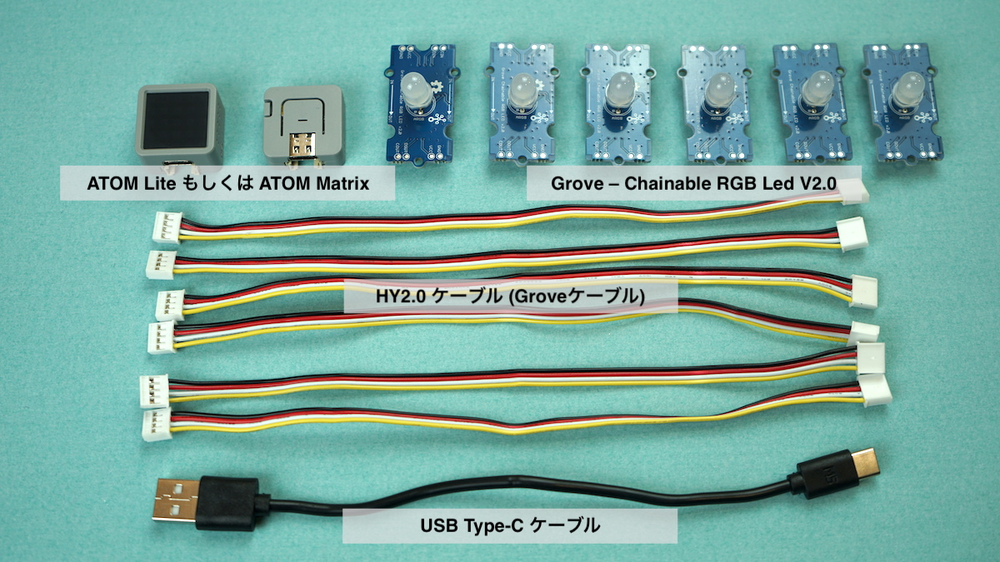
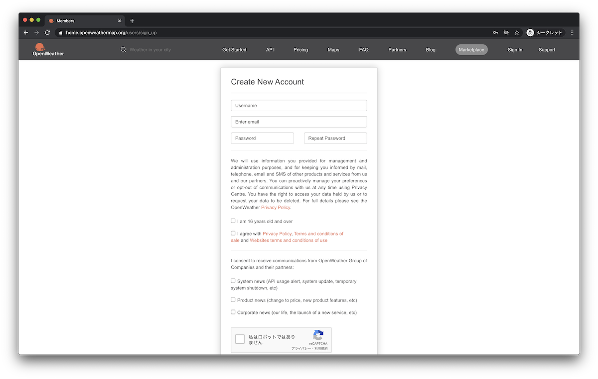
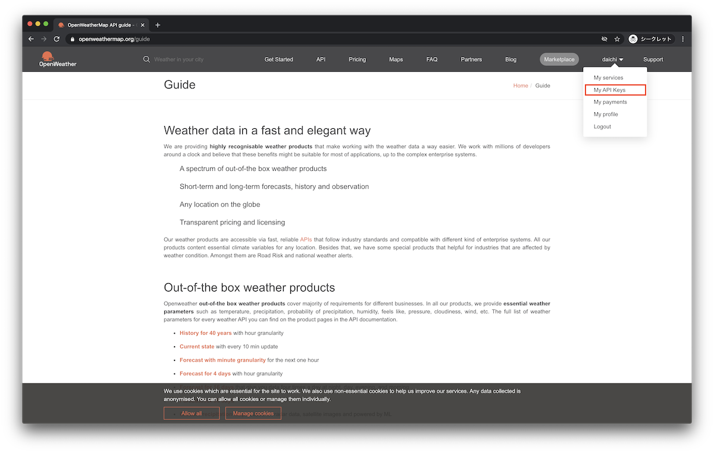
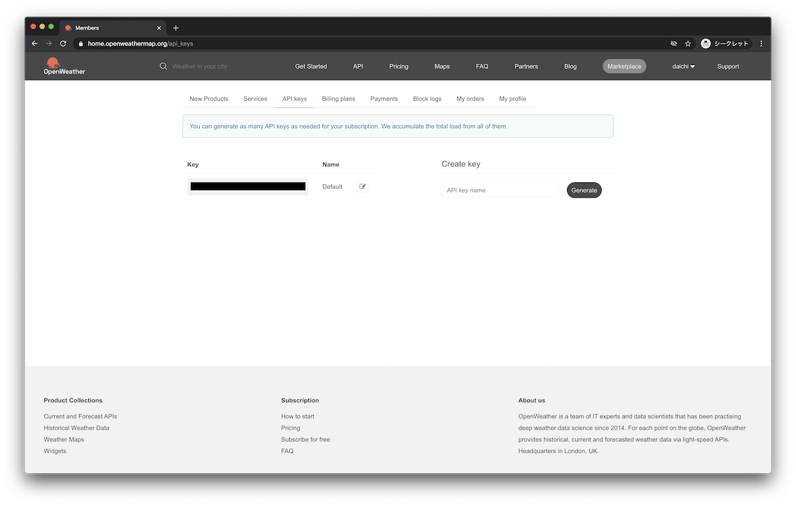
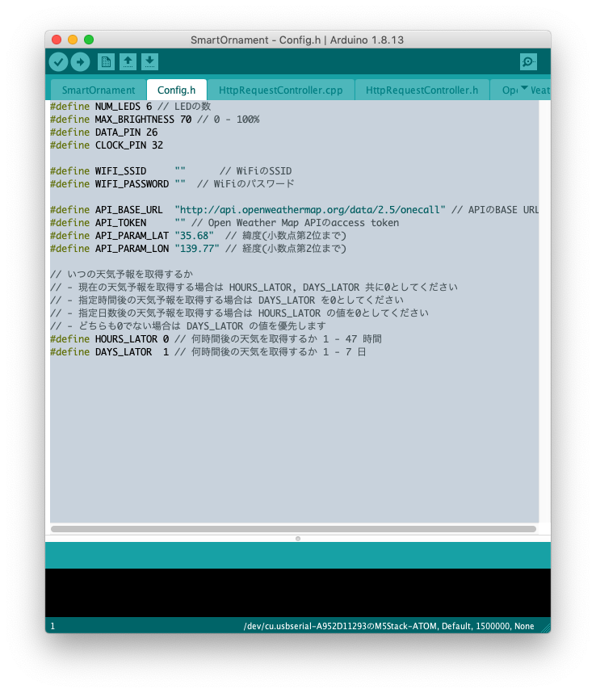

#  D+IO Project
**パナソニック株式会社/FUTURE LIFE FACTORY**
<br>D+IOプロジェクトは、人間が本来備え持っている創造力をエンパワーするプロジェクトです。
### [D+IO プロジェクト詳細](https://panasonic.co.jp/design/flf/works/doing_io/)
<a href="https://panasonic.co.jp/design/flf/works/doing_io/"></a>

<br><br>

## 【D+IO PRODUCT 第4弾】 スマートオーナメント SmartOrnament
第4弾は、季節の飾りをスマート化できる「スマートオーナメント SmartOrnament」です。
LEDの色で明日の天気が分かります。

**ソースコードは別リポジトリです**
<br>[https://github.com/panasonic-corporation/doingio-smart-ornament](https://github.com/panasonic-corporation/doingio-smart-ornament)


<br>


クリスマスやハロウィンなど、季節に合わせて飾り付けるオブジェクト。
そのオーナメントをインターネットにつなげて少しスマートにしたらどうなるでしょう。

例えば天気予報の情報をWeb上から取得すれば、明日の天気に応じてオーナメントのLEDの色を変えることができます。

空間を彩る飾りに機能を付加することで、少し生活が便利になるかもしれません。

APIを変えたり光り方をカスタマイズし、あなたの欲しい情報を可視化してみましょう！

# [SmartOrnament] 作り方ドキュメント
ATOM Matrix / ATOM Liteで作るeasyHOTLINEの作り方を紹介します。

**ソースコードは別リポジトリです<br>[https://github.com/panasonic-corporation/dio-smart-ornament](https://github.com/panasonic-corporation/dio-smart-ornament)**

  
# 作り方

## 1 準備

### 必要なパーツを用意



|     | 部品名     | 個数 |  販売リンク（例）         | 備考 |
|:----:|:---------|:----|:------------------------|:----|
|  1  | ATOM Lite | 1 |[スイッチサイエンス](https://www.switch-science.com/catalog/6262/) | 1〜2のうちどれかひとつは必須 |
|  2  | ATOM Matrix | 1 |[スイッチサイエンス](https://www.switch-science.com/catalog/6260/) | 1〜2のうちどれかひとつは必須 |
|  3  | USB TypeCケーブル | 1 | | M5Stack Basic, M5Stack Core2 に付属 |
|  4  | Grove – Chainable RGB Led V2.0 | 数個 |[千石電商](https://www.sengoku.co.jp/mod/sgk_cart/detail.php?code=EEHD-58AT) | 取り付けるオブジェの大きさに応じて個数を決めてください |
|  5  | HY2.0 ケーブル (Groveケーブル) | 数個 | | Grove – Chainable RGB Led V2.0 に付属 |
|  6  | クリスマスツリーなどのオブジェ | 1 | [東急ハンズ](https://hands.net/cate/party/christmas/christmastreeset/) | リースや正月飾りなど何でもOK |
|  7  | 配線隠し用のリボンなど | 1 | [東急ハンズ](https://hands.net/goods/4560374724705/) | |

★ 参考価格（総額） : 約4,500円 前後（税込み, オブジェ抜き）


## 2 配線 / 組み立て

1. ATOM Lite / ATOM Matrix に Groveケーブルを接続します。

    

1. LED に Groveケーブルを接続します。 基板に記載されている IN という表記がある方のコネクタにケーブルを挿してください。

    

1. ATOM LIte / ATOM Matrix から LED終端に向かって IN → OUT となるようにLEDとGroveケーブルを接続していきます。

    

1. 必要な分だけLEDを接続します。

    

1. ケーブルや基板を隠すためリボンなどを巻きます。

    


## 3 開発環境のダウンロードとインストール

下記リンクを参考に開発環境をインストールしてください。

[M5Stack開発環境のダウンロードとインストール](https://github.com/panasonic-corporation/doingio-base-docs/blob/master/README.md#a-m5stack%E9%96%8B%E7%99%BA%E7%92%B0%E5%A2%83%E3%81%AE%E3%83%80%E3%82%A6%E3%83%B3%E3%83%AD%E3%83%BC%E3%83%89%E3%81%A8%E3%82%A4%E3%83%B3%E3%82%B9%E3%83%88%E3%83%BC%E3%83%AB)

## 4 ファームウェアのダウンロード

1. ファームウェアをダウンロードしてください。

    https://github.com/panasonic-corporation/doingio-smart-ornament

    

1. プロジェクトを開いてください。

    ダウンロードしたフォルダを開き、doingio-smart-ornament/SmartOrnament/SmartOrnament.ino をダブルクリックしてArduino IDEで開きます。


## 5 ライブラリのダウンロードとインストール

1. ”スケッチ” → ”ライブラリをインクルード” → ”ライブラリを管理”「fastled」と検索して「FastLED」をインストールしてください  

    


## 6 外部サービスとの連携
ここでは[Open Weather Map API](https://openweathermap.org/)と連携する方法を記載します。

1. https://home.openweathermap.org/users/sign_up にアクセスして必要事項を記入しアカウントを登録します。アカウントを持っていなければアカウントを作成してください。アカウントを持っていればそのままログインしてください。

    

1. ログインしたら https://openweathermap.org/api にアクセスし、「My API Keys」をクリックしてください。

    

1. 「API keys」タブを選択してapi keyを表示します。このあとの設定で使うのでコピーしておいてください。

    

## 7 Config.h の設定

1. Arduino IDEの右上の逆三角アイコンをクリックし、Config.hを選択します。

    

1. Arduino IDEでconfig.hを開き、下記項目を修正します。
    - NUM_LEDS : 接続しているLEDの数
    - MAX_BRIGHTNESS : LEDの最高輝度 (%表記)
    - WIFI_SSID  : WiFiのSSID
    - WIFI_PASSWORD : WiFiのパスワード
    - API_TOKEN : 先程OpenWeatherMapで取得したAPI key
    - API_PARAM_LAT : 取得したい天気の場所の緯度(小数点2位まで)
    - API_PARAM_LON : 取得したい天気の場所の経度(小数点2位まで)
    - HOURS_LATOR : 何時間後の天気を取得するか
    - DAYS_LATOR : 何日後の天気を取得するか
    ```
    ※ HOURS_LATOR / DAYS_LATORについて
      いつの天気予報を取得するかを設定できます。
      現在の天気予報を取得する場合は HOURS_LATOR, DAYS_LATOR 共に0としてください
      指定時間後の天気予報を取得する場合は DAYS_LATOR を0としてください
      指定日数後の天気予報を取得する場合は HOURS_LATOR の値を0としてください
      どちらも0でない場合は DAYS_LATOR の値を優先します
    ```

    

## 8 書き込み

1. PCとデバイスをUSBケーブルで接続し、Arduino IDEの「ツール」タブを開き下記の通り設定します。

    

1. 「書き込み」アイコンをクリックしてArduinoにファームウェアを書き込みます。

    

## 9 動作確認
- USBケーブルを電源に差すと起動します。

    クリスマスツリーなどのオブジェに設置して完成です！

- 色と天気の関連はデフォルトで下記のようになっています。

    | 天気 | 色 |
    |:----|:----|
    |  Thunderstorm  | Yellow |
    |  Drizzle | Cyan |
    |  Rain | Blue |
    |  Snow | Red |
    |  Atmosphere | Purple |
    |  Clear | White |
    |  Clouds | Green |
